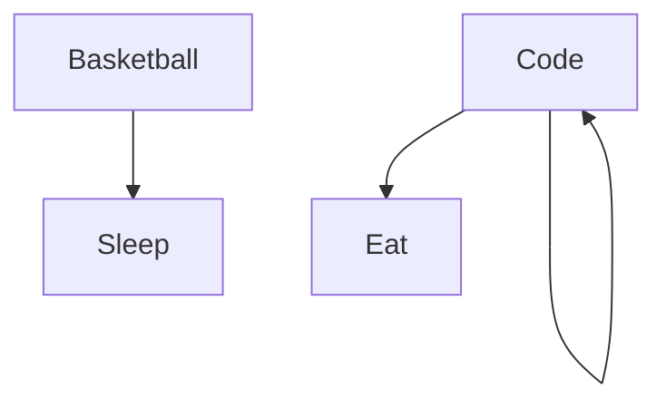

### Hi there 👋

# WAMSNET
I'm WANGMBARA OLIVIER from Cameroon, living in Maroua 🌴, FullStack developper , I do content on Development and Freelancing. I really enjoy learning languages and frameworks like Flutter and React. 

<!--
**wamsnet/wamsnet** is a ✨ _special_ ✨ repository because its `README.md` (this file) appears on your GitHub profile.
-->
Actually:

- 🔭 I’m currently working on a new [Online Course][courses] ...
- 🌱 I’m currently learning amazing things ...
- 👯 I help people to be programmers and freelancers ...
- ⚡ Fun fact : I'am DJ, Diver, Skateboarder and Surfer
- 📫 How to reach me: Instagram or email

### Connect with me:

&nbsp;&nbsp;

&nbsp;&nbsp;

&nbsp;&nbsp;

### Languages and Tools:

[][youtubeplaylist]

[][youtubeplaylist]
[][youtubeplaylist]
[][youtubeplaylist]
[][youtubeplaylist]
[][youtubeplaylist]
[][youtubeplaylist]
[][youtubeplaylist]
[][youtubeplaylist]
[][youtubeplaylist]

[][youtubeplaylist]

 
 

### My daily routine :

### ⭐ GitHub Stats

